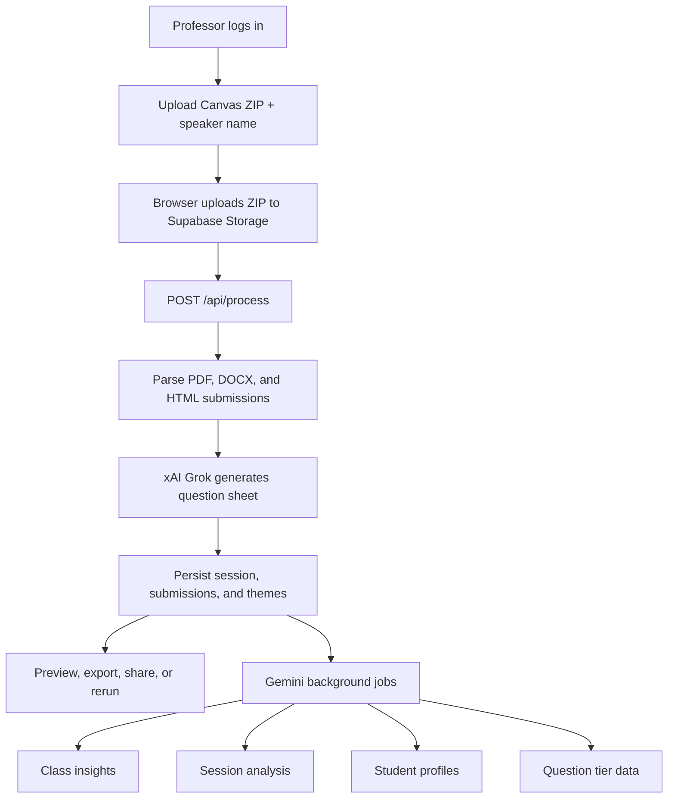
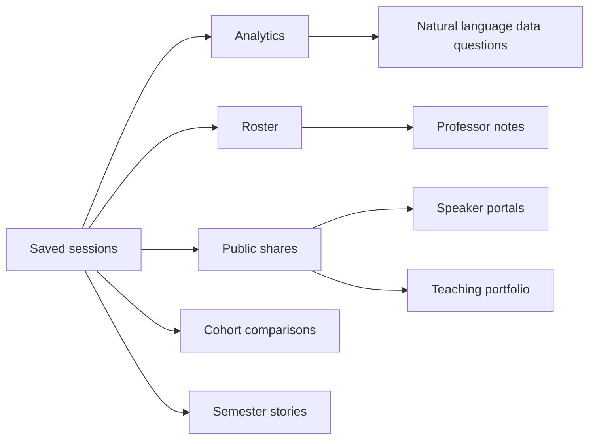
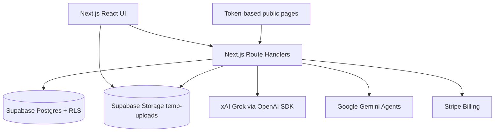

# Drennen Software

An AI-powered guest speaker intelligence system for MGMT 305. Professors upload Canvas student submissions, generate moderator-ready question sheets, and build a longitudinal view of student engagement, themes, growth, and speaker-session outcomes.

> This repository is the codebase connected to `https://github.com/Metdez/Drennen-Software.git`.

## Table of Contents

- [What It Does](#what-it-does)
- [Core Workflows](#core-workflows)
- [Architecture](#architecture)
- [Tech Stack](#tech-stack)
- [Project Structure](#project-structure)
- [Getting Started](#getting-started)
- [Environment Variables](#environment-variables)
- [Database and Storage](#database-and-storage)
- [Available Scripts](#available-scripts)
- [Verification](#verification)
- [Deployment](#deployment)
- [Operational Notes](#operational-notes)

## What It Does

Drennen Software turns a Canvas ZIP export of student questions into a structured, speaker-ready interview sheet. It also preserves each session as teaching intelligence: student participation, recurring themes, question quality, growth signals, speaker feedback, semester reports, and public teaching portfolio views.

Key capabilities:

- Generate 10-section guest speaker question sheets from PDF, DOCX, and HTML/text-entry Canvas submissions.
- Export session outputs, semester reports, and semester stories as PDF or DOCX.
- Analyze sessions with Gemini-powered theme clusters, blind spots, sentiment, tensions, and interview suggestions.
- Track student participation, interests, growth trajectory, professor notes, and follow-up flags.
- Manage semesters, assign sessions, compare cohorts, and generate semester-level reports.
- Publish token-based public views for shared sessions, semester comparisons, speaker portals, and teaching portfolios.
- Analyze post-session student reflections and formal speaker-analysis essays.
- Use Stripe subscriptions, free-session access checks, Checkout, invoices, webhooks, and billing portal flows.
- Customize system prompts and rerun session generation with saved prompt versions.

## Core Workflows





## Architecture

The application is a Next.js App Router project with three primary route groups:

- `app/(auth)` contains login and auth-facing screens.
- `app/(app)` contains authenticated professor workflows.
- `app/(public)` contains token-based public views that do not require login.
- `app/api` contains route handlers for processing, analytics, sharing, Stripe, reports, stories, portfolios, and system prompts.

Authentication and route protection are handled by Supabase SSR middleware. User-scoped reads and writes use the cookie-backed Supabase client with RLS enforced. Controlled server-side jobs, storage operations, and webhooks use the service role client.



## Tech Stack

| Layer | Technology |
| --- | --- |
| Framework | Next.js 14 App Router, React 18, TypeScript |
| Styling | Tailwind CSS, CSS custom properties |
| Auth | Supabase Auth with SSR cookie handling |
| Database | Supabase Postgres with Row Level Security |
| Storage | Supabase Storage, `temp-uploads` bucket |
| Primary AI | xAI Grok through the OpenAI SDK |
| Analysis AI | Google Gemini through `@google/genai` |
| Parsing | `unzipper`, `pdf-parse`, `mammoth`, HTML parsing |
| Exports | `@react-pdf/renderer`, `docx` |
| Charts | Recharts |
| Payments | Stripe Checkout, Billing Portal, invoices, webhooks |
| Hosting | Vercel |

## Project Structure

```text
app/
  (auth)/                 Login and auth pages
  (app)/                  Protected professor application
  (public)/               Token-based public views
  api/                    Next.js route handlers
components/
  analytics/              Analysis and synthesis panels
  compare/                Semester comparison UI
  debrief/                Post-session debrief UI
  layout/                 Navigation, auth, account, sharing panels
  portfolio/              Public portfolio components
  report/                 Semester report sections
  semester/               Semester management components
  session/                Upload, processing, preview, sharing
  speaker/                Speaker brief and portal components
  student/                Roster, profiles, notes, growth intelligence
  subscription/           Paywall, subscription context, banners
  ui/                     Shared primitives
lib/
  ai/                     xAI and Gemini agents
  constants/              Routes, brand, AI, validation constants
  db/                     Supabase data access layer
  export/                 PDF, DOCX, text export helpers
  parse/                  Canvas ZIP, PDF, DOCX, HTML parsing
  stripe/                 Stripe client factory
  supabase/               Browser, server, admin, and storage clients
  utils/                  Formatting, transforms, errors
supabase/
  migrations/             Database schema and RLS migrations
scripts/                  One-off maintenance and AI utility scripts
types/                    Shared TypeScript domain types
```

## Getting Started

### Prerequisites

- Node.js 18 or newer
- npm
- Supabase CLI and a Supabase project
- xAI API key
- Google Gemini API key
- Stripe account for billing flows
- Vercel account for production deployment

### Local Setup

1. Clone the repository.

   ```bash
   git clone https://github.com/Metdez/Drennen-Software.git
   cd Drennen-Software
   ```

2. Install dependencies.

   ```bash
   npm install
   ```

3. Create a local environment file.

   ```bash
   cp .env.example .env.local
   ```

4. Fill in `.env.local` with Supabase, xAI, Gemini, Stripe, and database values.

5. Apply database migrations.

   ```bash
   npx supabase db push
   ```

   For local Supabase development, start Supabase first and use the local database URL from the CLI output. The repo includes migrations in `supabase/migrations/`.

6. Start the development server.

   ```bash
   npm run dev
   ```

7. Open `http://localhost:3000`.

The login page includes a demo ZIP shortcut backed by `public/mock-questions.zip`, which is useful for a smoke test once Supabase Auth and environment variables are configured.

## Environment Variables

The repository includes [.env.example](.env.example). Keep real secrets in `.env.local` for local development and in the deployment provider for production.

| Variable | Required | Purpose |
| --- | --- | --- |
| `NEXT_PUBLIC_SUPABASE_URL` | Yes | Supabase project URL |
| `NEXT_PUBLIC_SUPABASE_ANON_KEY` | Yes | Browser-safe Supabase anon key |
| `SUPABASE_SERVICE_ROLE_KEY` | Yes | Server-only Supabase service role key |
| `XAI_API_KEY` | Yes | xAI API key for primary question-sheet generation |
| `XAI_BASE_URL` | No | xAI OpenAI-compatible endpoint; defaults to `https://api.x.ai/v1` |
| `XAI_MODEL` | No | xAI model; defaults in code to `grok-4-1-fast-reasoning` |
| `GEMINI_API_KEY` or `GOOGLE_API_KEY` | Yes | Gemini API key for analytics, profiles, reports, stories, and portals |
| `GEMINI_MODEL` | No | Gemini model override |
| `STRIPE_SECRET_KEY` | Yes for billing | Server-only Stripe API key |
| `STRIPE_WEBHOOK_SECRET` | Yes for billing | Stripe webhook signing secret |
| `STRIPE_PRICE_MONTHLY` | Yes for billing | Monthly subscription price ID |
| `STRIPE_PRICE_ANNUAL` | Yes for billing | Annual subscription price ID |
| `DATABASE_URL` | Yes for SQL agent | Direct Postgres connection string used by analytics SQL tooling |
| `NEXT_PUBLIC_SITE_URL` | Recommended | Public site origin for checkout and billing redirects |

## Database and Storage

Schema changes are tracked in `supabase/migrations/`. Major tables include:

- `sessions`
- `student_submissions`
- `session_themes`
- `session_analyses`
- `student_profiles`
- `class_insights`
- `semesters`
- `semester_reports`
- `semester_stories`
- `session_shares`
- `portfolio_shares`
- `speaker_portals`
- `student_debrief_submissions`
- `student_speaker_analysis_submissions`
- `session_syntheses`
- `custom_system_prompts`

The main upload path uses Supabase Storage bucket `temp-uploads`:

1. Browser uploads the Canvas ZIP to a user-prefixed path.
2. `/api/process` downloads the ZIP with the service role client.
3. The ZIP is parsed and processed.
4. The temporary file is deleted in cleanup.

## Available Scripts

| Script | Description |
| --- | --- |
| `npm run dev` | Start the Next.js development server |
| `npm run build` | Build the production application |
| `npm run start` | Run the production server after build |
| `npm run lint` | Run Next.js linting |
| `npm run type-check` | Run TypeScript type checking without emitting files |
| `npx tsx scripts/backfill-tiers.ts` | One-off backfill for missing question tier data |

## Verification

There is no dedicated test runner script in `package.json` yet. Use these checks before pushing application changes:

```bash
npm run lint
npm run type-check
npm run build
```

For documentation-only changes, at minimum inspect Markdown rendering and confirm the README does not document endpoints, scripts, or environment variables that are not present in the repository.

## Deployment

This app is configured for Vercel in `vercel.json`:

- Framework: Next.js
- Install command: `npm install`
- Build command: `next build`
- Dev command: `next dev`
- `/api/process` max duration: 60 seconds

Deployment checklist:

1. Push the repository to GitHub.
2. Import the project into Vercel.
3. Add all required environment variables in Vercel.
4. Configure Supabase Auth redirect URLs for the deployed domain.
5. Apply Supabase migrations to the production project.
6. Create the `temp-uploads` storage bucket and policies if they are not already present.
7. Configure Stripe webhook delivery to `/api/stripe/webhook`.
8. Run a production smoke test with a small Canvas ZIP.

## Operational Notes

- Authenticated professor routes are protected by `middleware.ts`.
- Public session, comparison, portfolio, and speaker portal views use revocable token-based access.
- The primary `/api/process` request returns after the main question sheet is generated. Several Gemini jobs continue in the background and may populate analytics shortly afterward.
- The Supabase admin client bypasses RLS and should stay limited to storage operations, background jobs, and trusted webhook flows.
- `.env.local` is intentionally ignored. Never commit real API keys, service role keys, Stripe secrets, or database credentials.
